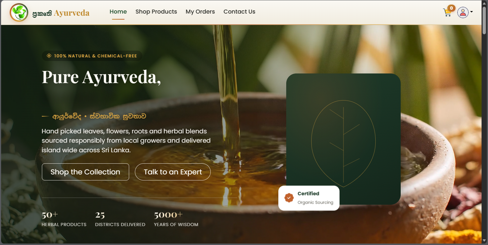
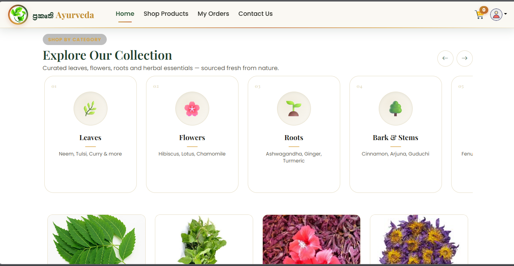
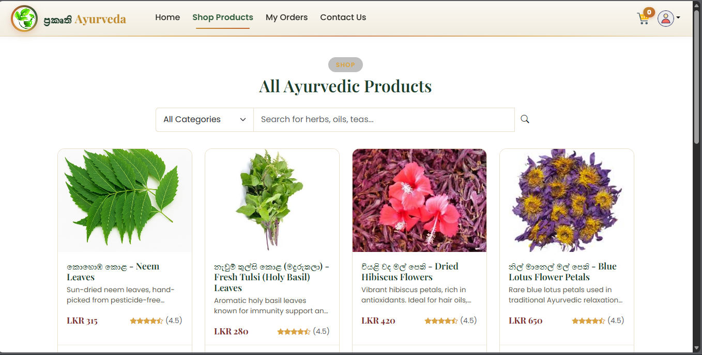
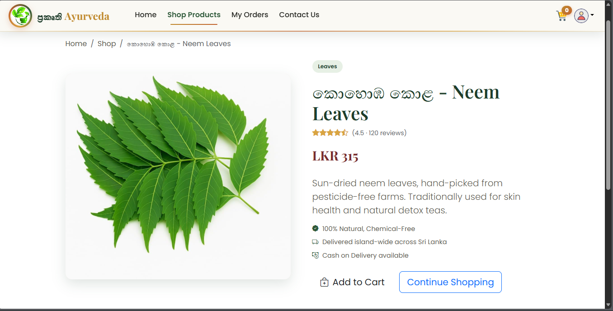
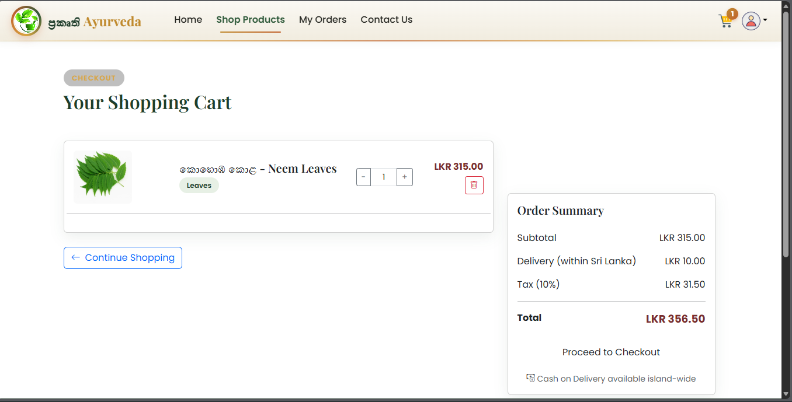
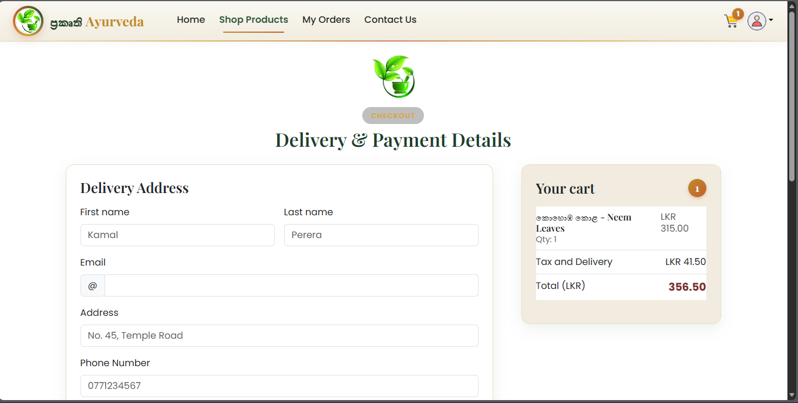
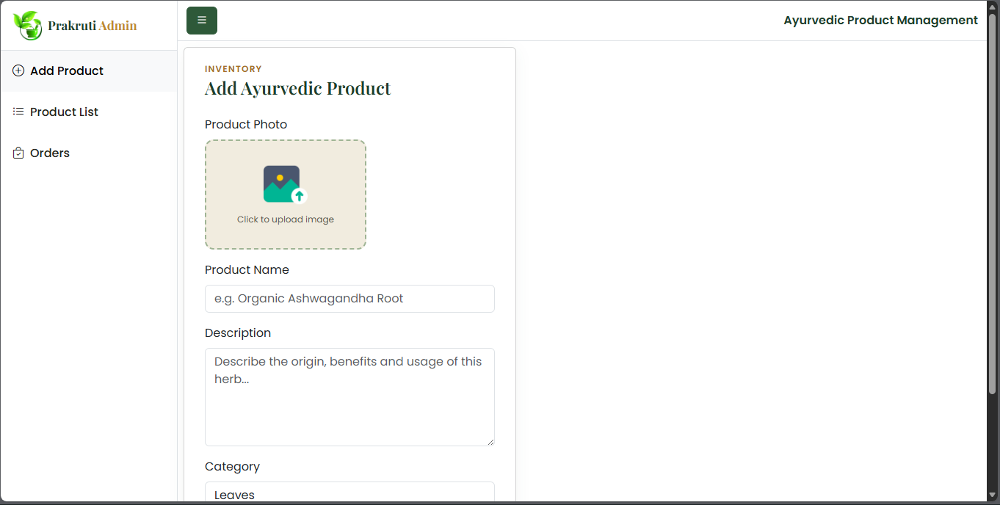
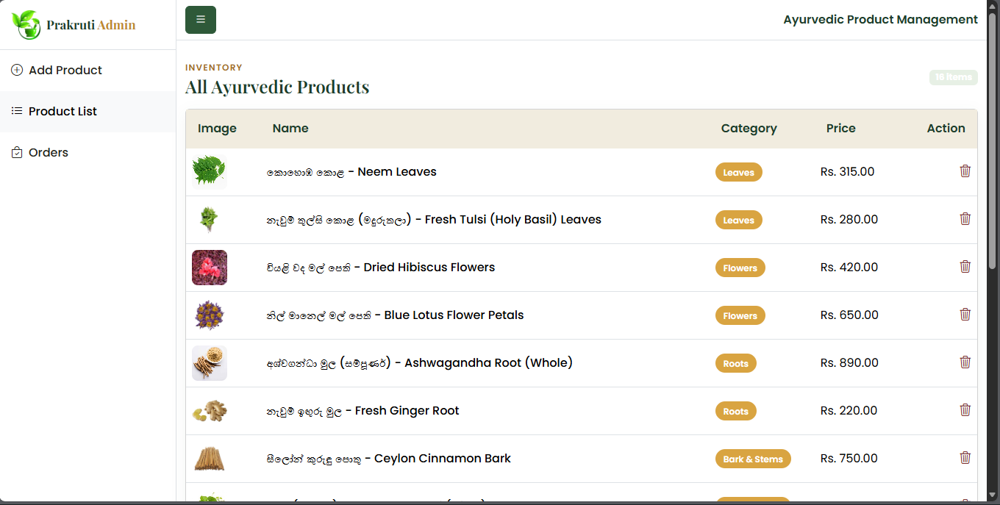

# ප්‍රකෘති Ayurveda

An e-commerce platform for Ayurvedic products in Sri Lanka — leaves, flowers, roots, bark, seeds, oils, powders, and herbal teas — rebuilt from a generic food-delivery starter project into a themed storefront with island-wide delivery covering all 25 districts and Cash on Delivery alongside card payments.

## Overview

The app has three parts: a customer-facing storefront, an admin panel, and a Spring Boot API backed by MongoDB.

- **Storefront** — browse products by category, search, view product detail, add to cart, and check out with an address form covering all 25 Sri Lankan districts.
- **Categories** — Leaves, Flowers, Roots, Bark & Stems, Seeds, Oils & Ghee, Powders, Herbal Tea — each a plain string on the product document, not an enum, so new categories are a data change, not a code change.
- **Cart & Checkout** — quantities tracked client-side against a live product list, server-computed order total, choice of Cash on Delivery or Stripe online payment at checkout.
- **My Orders** — order history with payment method and status per order, refreshable from the API.
- **Admin** — add, list, and delete products, each uploaded through Cloudinary rather than stored as raw file paths.

## Tech Stack

- **Spring Boot 3** (Java 17) — backend API
- **MongoDB Atlas** — source of truth for users, products, and orders
- **Spring Security + JWT** — stateless auth, tokens issued on login and checked on every protected route
- **Cloudinary** — product image hosting, decoupled from the API server's filesystem
- **Stripe** — payment link generation for online card payments
- **React 18 + Vite** — storefront and a separate admin panel, both consuming the same REST API
- **React Router** — routing in both frontends
- **Bootstrap 5 + Bootstrap Icons** — component styling, themed with CSS custom properties rather than a Sass rebuild
- **Axios** — HTTP client on both frontends

## Running Locally

```bash
git clone https://github.com/<your-username>/prakruti-ayurveda.git

cd prakruti-ayurveda/foddiesapi
./mvnw spring-boot:run
```

```bash
cd prakruti-ayurveda/userfront
npm install
npm run dev
```

```bash
cd prakruti-ayurveda/admin-panel
npm install
npm run dev
```

The backend runs at `http://localhost:8080`, the storefront at `http://localhost:5173`, and the admin panel on its own Vite port (check the terminal output).

There's no Docker Compose file yet — see [Roadmap](#roadmap) below — so each of the three parts is started separately, in the order above, since the frontends expect the API to already be reachable.

**Other commands:**

```bash

mongosh "mongodb+srv://<user>:<password>@<cluster-url>/deliverydb" seed-products.js
```

## Secrets

No credentials should be committed. `spring.data.mongodb.uri`, `jwt.secret`, `cloudinary.*`, and `stripe.secret.key` belong in `application.properties` locally, or better, as environment variables / a `.env` file excluded via `.gitignore`.


## Features Implemented

- [x] Browse products by category with live search/filter
- [x] Product detail page with quantity add-to-cart
- [x] Cart with per-item quantity controls and running totals
- [x] Checkout with delivery address covering all 25 Sri Lankan districts
- [x] Cash on Delivery and Stripe online payment, selectable per order
- [x] JWT-based registration and login
- [x] Order history per user, including payment method and status
- [x] Admin panel: add / list / delete products, images via Cloudinary
- [x] Responsive layout across storefront, checkout, and admin panel
- [x] MongoDB seed script for demo data across all 8 categories

## Core Design Decisions

### Category as a free-text field, not an enum

`FoodEntity.category` is a plain `String`, and the frontend's category list lives in one array (`assests.js`) rather than being baked into validation logic anywhere. Swapping "Biryani/Pizza/Burger" for "Leaves/Flowers/Roots/..." required editing that one array and the admin's dropdown — zero backend changes, zero schema migration.


### Payment method branching happens server-side, not just in the UI

Before this project, every order — regardless of what the frontend showed — got a Stripe payment link, because `OrderServiceImpl.createOrderWithPayments()` didn't check for one. Adding a `paymentMethod` field, and branching so Cash on Delivery orders skip Stripe link creation entirely and confirm immediately, was necessary for the frontend's COD option to be more than cosmetic.


### District as a fixed dropdown, city as free text

Sri Lanka has exactly 25 administrative districts, so that's a closed, stable list worth hardcoding into the checkout form. Cities/towns within a district are not remotely closed, so that field stays free text rather than a second dependent dropdown that would need its own data source.

### Emoji category icons instead of new image assets

The inherited project had food-photo PNGs (`burger.png`, `pizza.png`, etc.) with no Ayurvedic equivalents. Rather than sourcing and licensing new product photography before the rebrand could even be demoed, category icons use emoji (🌿🌸🌱...) defined right next to the category name in `assests.js` — swappable for real photographed icons later by changing one field per category, not by touching any component.

## Extra Credit Features

- **Cash on Delivery, added end-to-end** — not just a frontend toggle, but a real backend branch (`OrderRequest`, `OrderEntity`, `OrderResponse`, and the service method) so COD orders never touch Stripe.
- **MongoDB seed script** — `seed-products.js` inserts two realistic products per category, matched to Sri Lankan sourcing (Ceylon cinnamon, uluhaal/fenugreek, Ayurvedic ghee) rather than generic placeholder text, so a fresh clone has a populated storefront in one command.
- **Design token system** — a single CSS custom-property block (`--pk-green-700`, `--pk-gold-600`, `--pk-cream-100`, etc.) drives both the storefront and admin panel themes and overrides Bootstrap's own `--bs-primary` variables, so `btn-primary`, links, and badges follow the brand without a Sass recompile.

## Challenges Faced

- The `AddFood.jsx` form had a dead, duplicated "Contact Us" form pasted after `export default AddFood;` — unreachable code from what looks like a copy-paste mistake in the original project. Found it while rewriting the component, not before.
- `App.jsx` imported `./pages/OrderStatus/orderStatus` (lowercase) while the actual file on disk is `OrderStatus.jsx`. Works fine on case-insensitive filesystems (Windows/Mac), silently breaks the build on case-sensitive ones (Linux CI, most cloud hosts) — the kind of bug that only shows up at deploy time.
- `FoodDetail.jsx` called `toast.error(...)` in its catch block without importing `toast` at all — meant a fetch failure would throw a second, unrelated `ReferenceError` on top of whatever the original problem was.
- The original checkout built its delivery-address string with the district field interpolated twice (`${data.district} ${data.district}`) — a copy-paste typo that would have shipped visibly duplicated addresses to real deliveries had it gone unnoticed.
- `Cart.jsx` referenced `food.categary` (misspelled) while every other component and the backend used `category` — meant the category badge in the cart would always render `undefined`.
- Deciding whether to fake Cash on Delivery in the UI alone (cosmetic radio button) or actually wire it through the backend — the honest answer required a small MongoDB/Spring change instead of a purely cosmetic frontend one, which is why `paymentMethod` ended up threaded through `OrderRequest`, `OrderEntity`, and `OrderResponse` rather than staying client-side.

## Screenshots

**Homepage**

Hero section with Ayurvedic branding, trust badges, and category chips below.
 
**Shop / Explore**



Category filter, search bar, and paginated product grid.
 
**Product Detail**

Full product view with rating, price, and add-to-cart.
 
**Cart**

Line items, quantity controls, and order summary sidebar.
 
**Checkout**

District/city delivery form and Cash on Delivery vs online payment selector.
 
**contact**

contact details
 
**Admin — Add Product**

Image upload, category dropdown, and product form.
 
**Admin — Product List**

Themed table with delete confirmation.


## Demo Video

_Add a link or embed here once recorded._